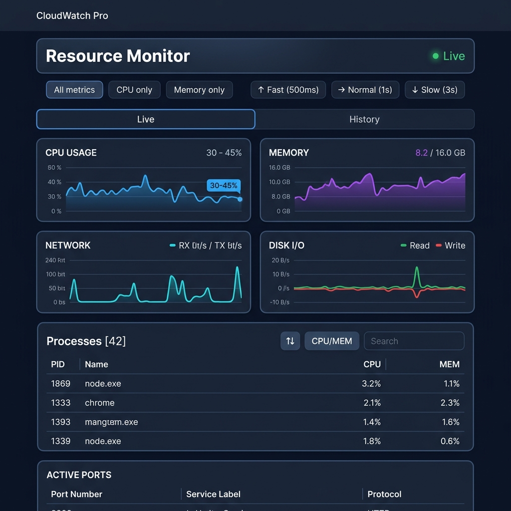

<div align="center">

# ⚡ CloudWatch Pro

**A real-time system resource monitor — built as a full-stack portfolio project**

[](https://nodejs.org/)
[](https://react.dev/)
[](https://vitejs.dev/)
[](https://socket.io/)
[](https://github.com/WiseLibs/better-sqlite3)
[](LICENSE)



</div>

---

## 📖 Overview

**CloudWatch Pro** is a full-stack, real-time system resource monitoring dashboard. It streams live CPU, memory, network, and disk metrics from your machine directly to a beautiful dark-themed web UI — with zero page reloads, persistent history charts, process inspection, and active port tracking.

> Built from scratch as a **portfolio project** to demonstrate full-stack skills: Node.js backend, WebSocket streaming, SQLite persistence, and a reactive React frontend.

---

## ✨ Features

| Feature | Description |
|---|---|
| 📡 **Real-time streaming** | WebSocket (Socket.io) delivers metrics every 1 second with configurable intervals (500ms / 1s / 3s) |
| 📊 **Live charts** | Scrolling line charts for CPU %, Memory, Network RX/TX, and Disk Read/Write |
| 🕒 **History tab** | Persistent SQLite-backed historical charts for the last 30 minutes |
| 🖥️ **Process table** | Live process list sortable by CPU or Memory, with search by name or PID |
| 🔌 **Active ports** | All open TCP/UDP ports with service label resolution and copy-to-clipboard |
| 🔔 **Toast alerts** | Auto-dismissing notifications for CPU spikes (>80%), connection state changes |
| ⌨️ **Keyboard shortcuts** | `1` → Live view, `2` → History, `R` → Refresh |
| 🚦 **Connection indicator** | Live green dot / yellow "Connecting" / red error state in the header |
| 🛡️ **Rate limiting** | 200 requests/minute per IP to prevent API abuse |
| 🧹 **Auto-cleanup** | DB rows older than 24 hours are purged hourly |

---

## 🖼️ Screenshots

<div align="center">

### Live Dashboard


</div>

---

## 🗂️ Project Structure

```
CloudWatch_Pro/
├── backend/                   # Express + Socket.io API server
│   ├── collector/             # systeminformation metrics emitter
│   ├── db/                    # SQLite (better-sqlite3) persistence layer
│   │   └── metrics.js         # openDb, insertSnapshot, queryHistory, getDbStats
│   ├── middleware/            # requestLogger, rateLimit, errorHandler
│   ├── routes/
│   │   ├── metrics.js         # GET /api/metrics
│   │   ├── processes.js       # GET /api/processes
│   │   ├── ports.js           # GET /api/ports
│   │   └── history.js         # GET /api/history?range=30m
│   ├── socket/                # Socket.io server setup
│   └── server.js              # Entry point, Express app bootstrap
│
└── frontend/                  # React + Vite SPA
    └── src/
        ├── api/               # Axios/fetch client config
        ├── components/
        │   ├── Header.jsx     # Title, connection status, control buttons
        │   ├── MetricsGrid.jsx# 2×2 chart grid
        │   ├── charts/        # CpuChart, MemoryChart, NetworkChart, DiskChart
        │   ├── ProcessTable.jsx # Sortable, searchable process list
        │   ├── PortsList.jsx  # Active ports with filter & copy
        │   ├── HistoryView.jsx# Historical line charts from SQLite
        │   └── Toast.jsx      # Toast notification system
        ├── hooks/
        │   ├── useMetrics.js  # Socket.io real-time data hook
        │   ├── useRollingData.js # Fixed-length rolling array hook
        │   └── usePrevious.js # Previous value ref hook
        ├── App.jsx            # Tab routing, keyboard shortcuts, alert logic
        └── index.css          # CSS variables, dark theme, animations
```

---

## 🛠️ Tech Stack

### Backend
| Technology | Version | Purpose |
|---|---|---|
| **Node.js** | ≥ 18 | Runtime |
| **Express** | 5.x | REST API framework |
| **Socket.io** | 4.x | WebSocket real-time streaming |
| **systeminformation** | 5.x | Cross-platform OS metrics |
| **better-sqlite3** | 12.x | Embedded SQLite database |
| **cors** | 2.x | CORS middleware |

### Frontend
| Technology | Version | Purpose |
|---|---|---|
| **React** | 19 | UI library |
| **Vite** | 8 | Build tool & dev server |
| **Recharts** | 3.x | Composable chart library |
| **socket.io-client** | 4.x | WebSocket client |
| **Vanilla CSS** | — | Custom dark theme, animations |

---

## 🚀 Getting Started

### Prerequisites

- [Node.js](https://nodejs.org/) **v18 or later**
- npm (bundled with Node.js)
- Git

### 1. Clone the repository

```bash
git clone https://github.com/Gnanasekaran2004/CloudWatch_Pro.git
cd CloudWatch_Pro
```

### 2. Install & start the backend

```bash
cd backend
npm install
node server.js
```

> The API server starts at **http://localhost:3000**

### 3. Install & start the frontend

Open a **new terminal**, then:

```bash
cd frontend
npm install
npm run dev
```

> The React dev server starts at **http://localhost:5173**

### 4. Open the app

Navigate to **[http://localhost:5173](http://localhost:5173)** in your browser.

---

## 📡 REST API Reference

| Method | Endpoint | Description |
|---|---|---|
| `GET` | `/api/metrics` | Latest snapshot (CPU, memory, disk, network) |
| `GET` | `/api/processes` | Running process list |
| `GET` | `/api/ports` | Active TCP/UDP ports |
| `GET` | `/api/history?range=30m` | Historical snapshots (`30m`, `1h`, `6h`, `24h`) |
| `GET` | `/api/db/stats` | Database row count and timestamp bounds |
| `GET` | `/api/health` | Health check (redirects to metrics health) |
| `GET` | `/api/socket-stats` | Connected WebSocket clients info |

### WebSocket Events

| Event | Direction | Payload |
|---|---|---|
| `metrics` | Server → Client | Full metrics snapshot |
| `subscribe` | Client → Server | `"cpu"` \| `"memory"` \| `"all"` |
| `setInterval` | Client → Server | Interval in ms (e.g. `500`) |

---

## ⚙️ Configuration

| Variable | Default | Description |
|---|---|---|
| `PORT` | `3000` | Backend HTTP/WebSocket port |
| Snapshot interval | every 5th event | DB write throttle (1 insert per 5 snapshots) |
| History retention | 24 hours | Auto-deleted rows older than 24h |
| Rate limit | 200 req/min | Per-IP REST API rate limit |

---

## 🏗️ How It Works

```
systeminformation
      │  polls OS every 1 s
      ▼
 MetricsEmitter (EventEmitter)
      │  emits "snapshot"
      ├──────────────────────────▶  Socket.io  ──▶  Browser (React)
      │                                              live charts update
      │  every 5th snapshot
      ▼
 better-sqlite3 (metrics.db)
      │  stores cpu, memory, disk, network
      ▼
 GET /api/history  ──▶  HistoryView (Recharts line charts)
```

---

## 🤝 Contributing

Pull requests are welcome! For major changes, please open an issue first to discuss what you'd like to change.

1. Fork the repo
2. Create your branch: `git checkout -b feature/my-feature`
3. Commit your changes: `git commit -m "feat: add my feature"`
4. Push: `git push origin feature/my-feature`
5. Open a Pull Request

---

## 📄 License

This project is licensed under the **MIT License** — see the [LICENSE](LICENSE) file for details.

---

<div align="center">

Made with ❤️ by [Gnanasekaran](https://github.com/Gnanasekaran2004)

⭐ Star this repo if you find it useful!

</div>
